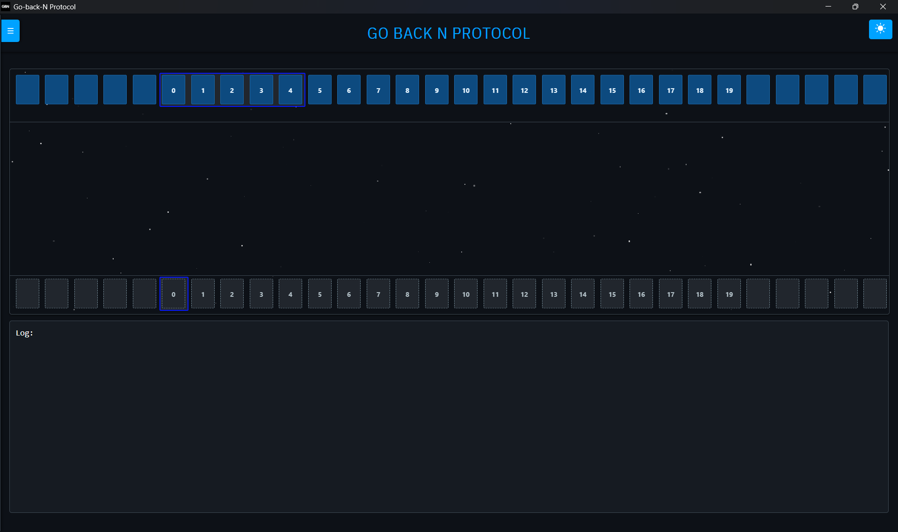
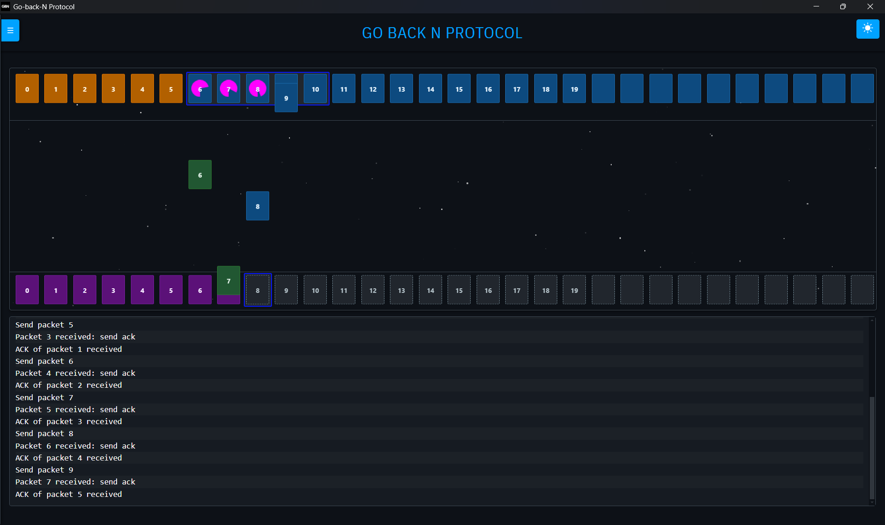
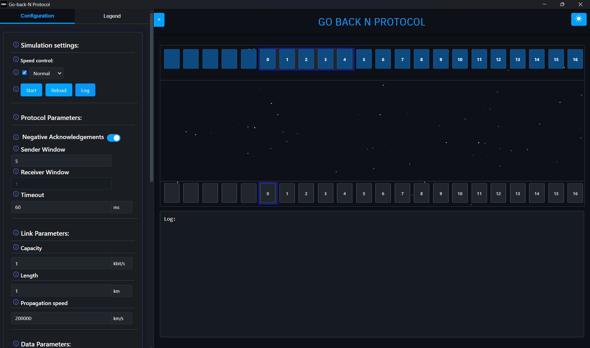
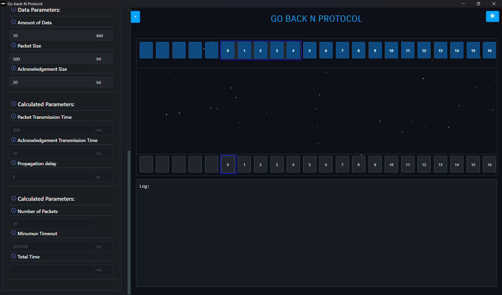
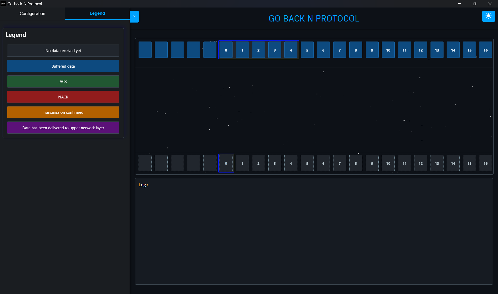

# Go-Back-N Protocol Simulator

## Overview

The Go-Back-N Protocol Simulator is an interactive web-based tool designed for educational purposes to demonstrate how the Go-Back-N sliding window protocol works in computer networking. This simulator provides a visual representation of packet transmission, acknowledgment, and error recovery mechanisms, helping students and networking enthusiasts understand the protocol's behavior under various conditions.

## Features

- **Interactive Visual Simulation**: Watch packets flow between sender and receiver with clear animations
- **Configurable Parameters**: Adjust window sizes, transmission speeds, packet sizes, and more
- **Error Handling Simulation**: Click on packets during transmission to simulate packet loss
- **Performance Analysis**: View real-time logs and analyze protocol behavior
- **Dual Mode Operation**: Choose between standard Go-Back-N behavior
- **NACK Support**: Toggle between using only ACKs or enabling NACKs for faster recovery
- **Speed Control**: Multiple simulation speed options from very slow to very fast
- **Dark/Light Themes**: Switch between visual themes for comfortable viewing

## How Go-Back-N Works

Go-Back-N is a sliding window protocol that provides reliable data transfer over unreliable networks. Key characteristics include:

- **Sliding Window**: The sender maintains a window of unacknowledged packets that can be sent without waiting for individual acknowledgments
- **Cumulative ACKs**: Receiver acknowledges frames by sending the sequence number of the next expected frame
- **Error Recovery**: When an error occurs, the sender "goes back" and retransmits all frames starting from the lost one
- **In-Order Delivery**: Receiver accepts packets only in sequence, discarding out-of-order packets
- **Flow Control**: The window size controls the flow of packets to prevent overwhelming the receiver

## Getting Started

### Installation

1. **Download the Simulator**:
   - Go to the **Releases** section of this repository
   - Download the latest release ZIP file

2. **Extract the Files**:
   - Right-click the downloaded ZIP file
   - Select "Extract All..." or use your preferred extraction tool
   - Choose a destination folder for the extracted files

3. **Launch the Simulator**:
   - Navigate to the extracted folder
   - Run the `go-back-n-simulator.exe` file
   - The welcome screen will appear, ready for use

### Prerequisites

- Any modern web browser (Chrome, Firefox, Safari, Edge)
- No additional installations required - runs entirely in the browser

### Running the Simulator

1. Open the welcome page by opening `welcome.html` in your web browser
2. Click "START" to launch the simulator
3. The simulation interface will load, ready for configuration

## Using the Simulator

### Basic Controls

- **Start/Stop**: Begin or pause the simulation
- **Reload**: Reset the simulation to default settings
- **Log**: Toggle the visibility of the event log panel

### Configuration Options

#### Simulation Settings

- **Speed Control**: Adjust animation speed from very slow to very fast
- **Dark/Light Theme**: Toggle between visual themes using the theme button

#### Protocol Parameters

- **Sender Window**: Configure the size of the sender's sliding window (1-10)
- **Receiver Window**: Always set to 1 for standard Go-Back-N behavior
- **Timeout**: Set the time before retransmission attempts (in ms/s)
- **Negative Acknowledgements**: Toggle NACK support on/off

#### Network Parameters

- **Transmission Capacity**: Set network capacity in bits or Kbits per second
- **Link Length**: Configure the physical length of the connection
- **Propagation Speed**: Set the signal propagation speed
- **Data Size**: Configure the total amount of data to transmit
- **Unit Size**: Set the size of individual data units
- **ACK Size**: Configure the size of acknowledgment packets

### Interacting with the Simulation

1. **Configure Parameters**: Set desired network and protocol parameters
2. **Start Simulation**: Click "Start" to begin packet transmission
3. **Observe Behavior**: Watch as packets travel between sender and receiver
4. **Simulate Errors**: Click on packets during transit to simulate packet loss
5. **Monitor Recovery**: Observe how the protocol recovers from errors
6. **Analyze Logs**: Review the log output to understand protocol behavior

### Using the Sidebar Controls

The simulator features a comprehensive sidebar with controls divided into two tabs: Configuration and Legend.

#### Navigating the Sidebar

- **Tab Navigation**: Switch between the "Configuration" and "Legend" tabs by clicking on the respective tab buttons
- **Toggle Sidebar**: Use the "×" button to collapse or expand the sidebar
- **Tooltips**: Hover over the information icons (ⓘ) next to each control to see detailed explanations

#### Configuration Controls

##### Protocol Parameters

- **Sender Window Size**: Control how many unacknowledged packets can be in transit at once
  - Larger values increase throughput but may cause more retransmissions on error
  - Range: 1-10 packets

- **Receiver Window Size**: Always set to 1 for standard Go-Back-N
  - This enforces in-order delivery of packets

- **Timeout Value**: Adjust how long the sender waits before retransmitting
  - Too short: Unnecessary retransmissions
  - Too long: Slow recovery from packet loss
  - Units can be switched between microseconds (μs), milliseconds (ms), and seconds (s)

- **Negative Acknowledgements**: Toggle between modes
  - ON: Receiver sends NACKs for out-of-order packets, enabling faster recovery
  - OFF: Relies solely on duplicate ACKs and timeouts for error detection

##### Network Parameters

- **Transmission Capacity**: Set the data rate of the connection
  - Higher values reduce transmission times
  - Adjustable in bits/s, Kbits/s, or Mbits/s

- **Link Length**: Set the physical distance data must travel
  - Affects propagation delay
  - Adjustable in meters, kilometers, or miles

- **Propagation Speed**: Set how fast signals travel through the medium
  - Typical values: 200,000 km/s (copper), 300,000 km/s (vacuum/fiber)
  - Adjustable in m/s, km/s, or miles/s

- **Data Size**: Configure total amount of data to transmit
  - Larger values create more packets to transmit
  - Adjustable in bits, Kbits, or Mbits

- **Unit Size**: Set the size of each packet
  - Smaller units create more numerous, smaller packets
  - Larger units create fewer, larger packets
  - Adjustable in bits, Kbits, or Mbits

- **ACK Size**: Set the size of acknowledgment packets
  - Affects ACK transmission time
  - Typically smaller than data packets
  - Adjustable in bits, Kbits, or Mbits

##### Simulation Controls

- **Auto Speed Control**: When checked, dynamically adjusts simulation speed
  - Useful for visualizing both fast and slow protocol operations
  - When enabled, allows setting a speed factor

- **Speed Factor**: Controls relative simulation speed when auto speed is enabled
  - Higher values make the simulation run faster
  - Lower values slow it down for easier observation

- **Start/Stop**: Begin or pause the simulation
- **Reload**: Reset all parameters to default values
- **Log**: Toggle visibility of the detailed event log

#### Experimenting with Parameters

- **For Understanding Timeouts**: Try setting very long propagation delays and observe timeout behavior
- **For Window Size Impact**: Compare small vs. large window sizes with the same parameters
- **For Error Recovery**: Click on packets during transmission and observe recovery mechanisms
- **For NACK Benefits**: Run the same scenario with NACKs enabled vs. disabled to compare recovery time

#### Using the Legend Tab

Switch to the Legend tab to view a comprehensive guide to all visual elements in the simulation:

- Different packet colors and their meanings
- Window representations
- Visual states of packets (empty, in transit, confirmed, delivered)

This legend is particularly helpful when analyzing complex protocol behaviors during simulation.

## Understanding the Visualization

### Visual Elements

- **Sender Line**: The top horizontal line representing the sender
- **Receiver Line**: The bottom horizontal line representing the receiver
- **Sliding Window**: Blue outline showing the current window position
- **Data Packets**: Blue squares moving from sender to receiver
- **ACK/NACK Packets**: Green squares (ACKs) or red squares (NACKs) moving from receiver to sender
- **Timers**: Magenta circles (packet timeouts) and window timer for Go-Back-N

### Visual States
- **Packet States**: Empty (not transmitted), in-transit, confirmed (acknowledged), delivered, and lost packets (clicked, shown with red flash)

## Example Scenarios

- **Normal Operation**: Sequential transmission with small window size
- **Packet Loss Recovery**: Simulate loss by clicking packets and observe recovery
- **Window Size Comparison**: Test different window sizes under identical conditions

## Implementation Details

### Technologies Used
HTML5, CSS3, JavaScript, jQuery, Canvas for animations and timers

### Project Structure
- `welcome.html`: Landing page with introduction and starter animation
- `gbn_sr/index.html`: Main simulation page
- `global/`: Shared resources (js libraries, css stylesheets)

### Contributors
- Varun Gupta (2023BCS-071)
- Om Sahu (2023BCS-042)
- Rahul Shah (2023BCS-060)
- Harsh Patel (2023BCS-024)
